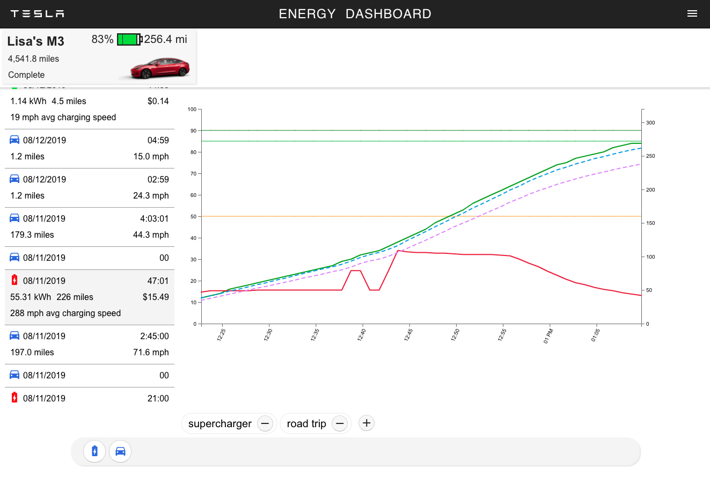
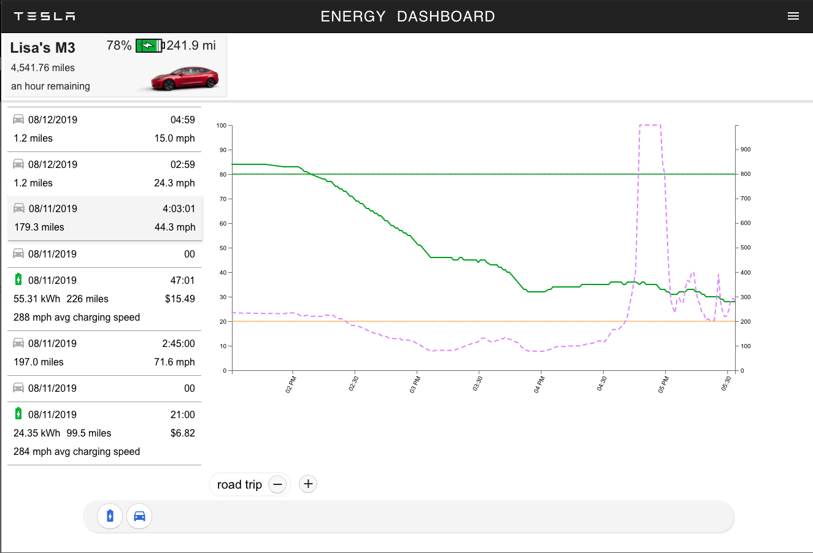

__This is a work in-progress__

Dashboard to visualize data collected from Tesla owner API, initially stored in Elasticsearch by my other project 
[tesla-es-poller](https://github.com/jchull/tesla-es-poller) 

The backend is now provided by my other, other project, using Express and MongoDB
[tesla-dashboard-server](https://github.com/jchull/tesla-dashboard-server).

Just getting started on this, and refreshing my React skills, learning the power of TypeScript, 
and getting more-comfortable with D3. The plan is to have an easy-to-use 
dashboard that can display the most-common charts and statistics.  

Here is some charging data, just getting the basics going

Here is a drive over a high pass and down for 57 minutes using 0Wh

This project was bootstrapped with [Create React App](https://github.com/facebook/create-react-app).

## Installing

__This is still REALLY rough__

1. MongoDB

    `docker run -d --name tesladb -p 29019:27017 --auth`

`db.createUser({ user: 'tsla_admin', pwd: 'XXXXX', roles: [ { role: 'userAdminAnyDatabase', db: 'admin' } ] });`
`db.createUser({ user: 'user_admin', pwd: 'YYYYYYY', roles: ['readWrite', 'dbAdmin'] });`
`db.createUser({ user: 'tsla', pwd: 'ZZZZZZZZZ', roles: ['readWrite', 'dbAdmin'] });`
    
2. Server and UI components
    
`git`
`cd tesla-dashboard-api`
`npm i`
`npm run build`
`npm link`

`cd ..`
`git`
`cd tesla-dashboard-server`
`npm link tesla-dashboard-api`
`npm i`
`npm run build`

Copy/edit config file: 'tesla-dashboard-server/config/sample.env' and save in same directory as '.env'
Update DB connection string:
DB_CONN=mongodb://tsla:$PASSWORD@$HOST:$PORT/tesladb

`npm start`

Now the DB and REST API should be running. In the future this will all come preconfigured.

Since the new user UI is not complete, to create a new user, the user service must be used with postman.
Note that this is STILL not secured. 

