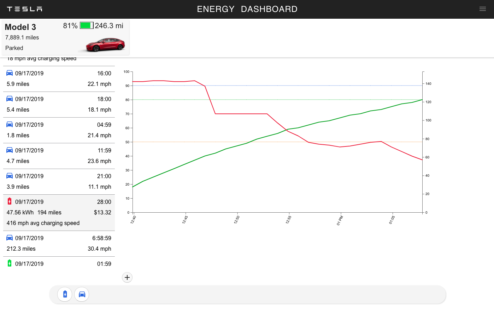
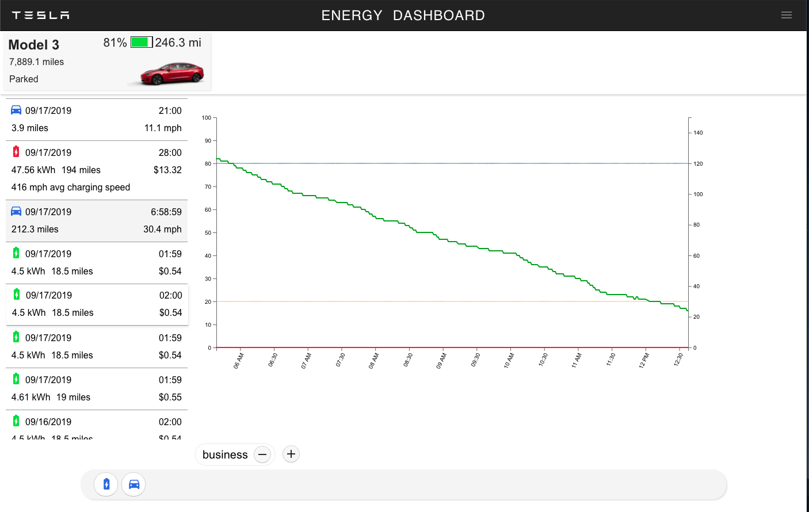

**Yet another dashboard to archive and visualize data collected from the Tesla owner API.** 

**_This is a work in-progress!_**

Here is some charging data at a V2 Supercharger. 

Here is a drive.

## Architecture
Programming Language: TypeScript

Server Framework: Nest.js

UI: React + Redux

Database: MongoDB

##Environments
Development: Docker-compose, Webpack

Test: Jenkins + Docker-compose

Production: Docker Swarm, HTTPS

## Installing from source

###### Clone this repository

`git clone https://github.com/jchull/tesla-dashboard.git`

###### Configure secrets
Copy server/env/sample.env to server/env/production.env

Use a complex, 32-ish char string for JWT_SECRET

Generate SSL certs
TODO

#### Building
Use docker-compose to build

`docker-compose build`

This creates images for DB and App services

#### Tests

yarn test

#### Starting services
Use docker-compose to run

`docker-compose up`

This should start the database, and build the web+server projects and start the prod server.

TODO: add scripts to build/update 
