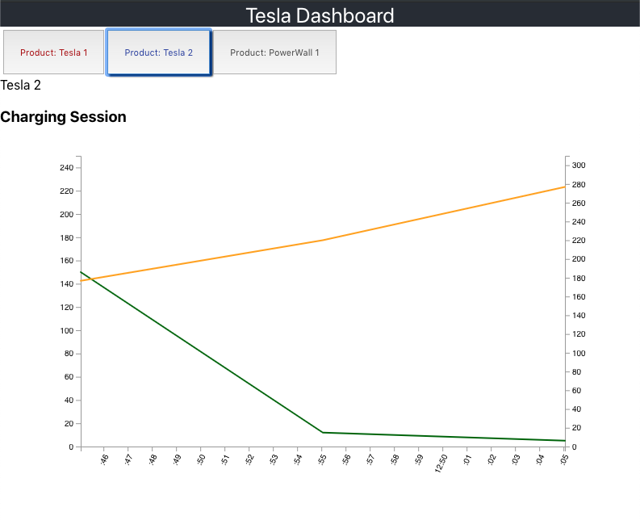

__This is a work in-progress__

Dashboard to visualize data collected from Tesla owner API, currently stored in Elasticsearch by my other project 
[tesla-es-poller](https://github.com/jchull/tesla-es-poller) with the backend in-development 
[tesla-dashboard-server](https://github.com/jchull/tesla-dashboard-server).

Just getting started on this, and refreshing my React skills, learning the power of TypeScript, 
and getting more-comfortable with D3. The plan is to have an easy-to-use 
dashboard that can display the most-common charts and statistics. Right now that is just charging, and the services are not 
completed, so it is not useful in any way right now. 

Here is some fake data, just getting the basics going

This project was bootstrapped with [Create React App](https://github.com/facebook/create-react-app).

## Available Scripts

In the project directory, you can run:

### `npm start`

Runs the app in the development mode. 
Open [http://localhost:3000](http://localhost:3000) to view it in the browser.

The page will reload if you make edits. 
You will also see any lint errors in the console.

### `npm test`

Launches the test runner in the interactive watch mode. 
See the section about [running tests](https://facebook.github.io/create-react-app/docs/running-tests) for more information.

### `npm run build`

Builds the app for production to the `build` folder. 
It correctly bundles React in production mode and optimizes the build for the best performance.

The build is minified and the filenames include the hashes. 
Your app is ready to be deployed!
