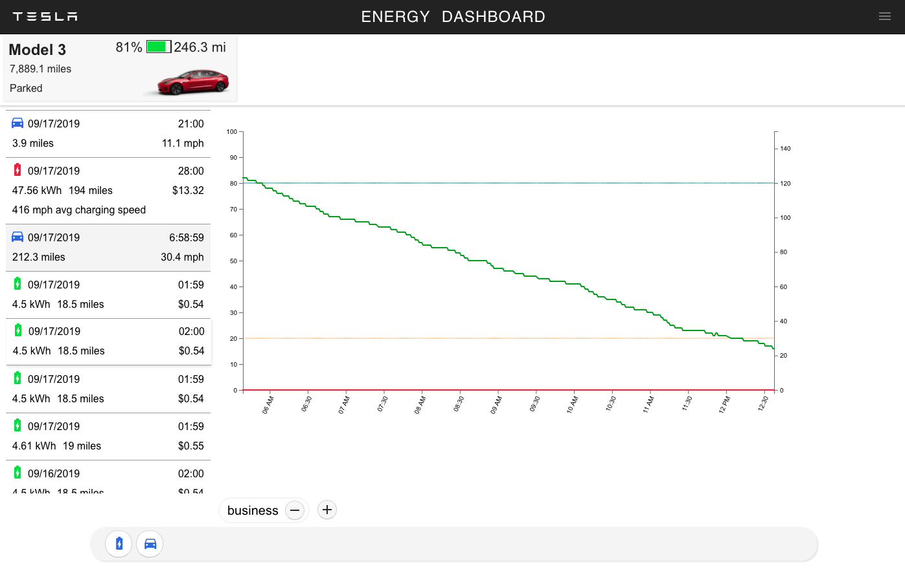

**Yet another dashboard to archive and visualize data collected from the Tesla owner API.**

**_This is a work in-progress!_**

Here is some charging data at a V2 Supercharger.

Here is a drive.

## Architecture

Programming Language: TypeScript

Server Framework: Nest.js

UI: React

State management: Redux w/ Redux Toolkit

Database: MongoDB

Monorepo: NX

## Installing from source

###### Clone this repository

`git clone https://github.com/jchull/tesla-dashboard.git`

###### Configure secrets

Copy apps/server/env/sample.env to apps/server/.local.env

Use a complex, 32-ish char string for JWT_SECRET

Generate SSL certs
TODO

#### Development Server
Just two steps to start up a development server:

`yarn`

`yarn start`

#### Building Docker images

Use docker-compose to build

`docker-compose build`

This creates images for Mongo DB and App server

#### Tests

yarn test

#### Starting services

Use docker-compose to run

`docker-compose up`

This should start the database, and build the web+server projects and start the prod server.

TODO: add scripts to build/update
